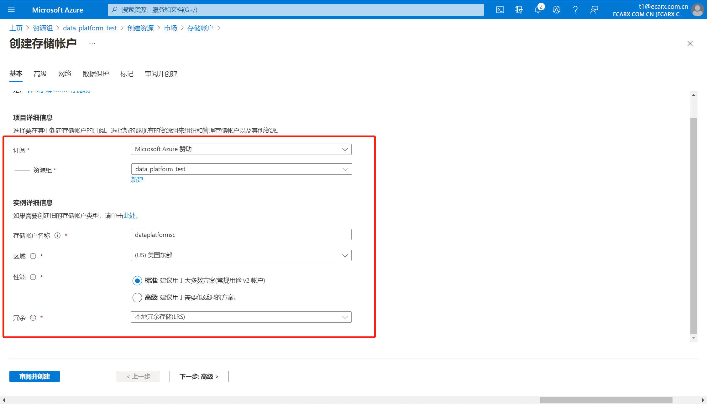
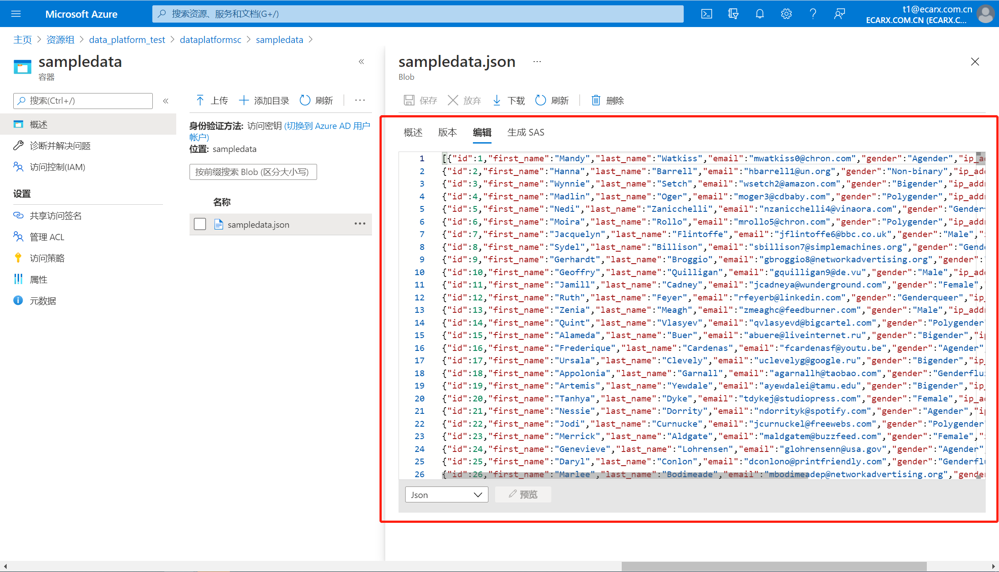

# 创建资源组

- 点击链接登录Azure Portal

https://portal.azure.com/#home

- 点击“资源组”

- 创建资源组

- 输入资源组名称

- 点击 “查看+创建”，得到“验证已通过”提示信息，再点一次“创建”

# 创建Azure Data Lake Storage Gen 2服务

- 点击进入这个我们新建的资源组，后续我们会依次创建ADLS GEN 2，Data Factory，Databricks和Cosmos DB四个服务，然后串起来成一个demo

- 在资源组页面中，点击“创建” - “市场”

- 市场中包含了azure上所有的服务。注意这里，我们如果直接去搜data lake，只有data lake storage gen 1的pass在这里，这个是我们之前讲的老的data lake。现在azure上还没有把直接创建adls gen 2的磁铁放在这里。

- ADLS GEN 2被集成在存储账户下。点击“创建”

- 在创建页面，选择订阅，选择资源组，填写存储账户名称，区域，性能和冗余。冗余中选择成本最低的“本地冗余存储（LRS）”即可。然后点击“下一步：高级”

- 在“高级”页面中，勾选“启用分层命名空间”。跳过“网络”、“数据保护”、“标记”，直接创建即可。

- 转到资源里以后可以看到这里的层次结构命名空间已经启动了，那我们的adls gen2就创建好了

- 在资源组界面中也能看到它

# 创建Azure Data Factory 数据工厂

1. 在左侧菜单中，选择“创建资源” > “集成” > “数据工厂” ：

- 在“新建数据工厂”页中，为以下字段提供值：
  - **名称**：输入 Azure 数据工厂的全局唯一名称。 如果收到错误“数据工厂名称 YourDataFactoryName 不可用”，请为数据工厂输入其他名称。 例如，可以使用名称 ***yourname*****ADFTutorialDataFactory**。 请重试创建数据工厂。 有关数据工厂项目的命名规则，请参阅[数据工厂命名规则](https://docs.microsoft.com/zh-cn/azure/data-factory/naming-rules)。
  - **订阅**：选择要在其中创建数据工厂的 Azure 订阅。
  - **资源组**：从下拉列表中选择现有资源组，或选择“新建”选项并输入资源组的名称。 若要了解有关资源组的详细信息，请参阅 [使用资源组管理 Azure 资源](https://docs.microsoft.com/zh-cn/azure/azure-resource-manager/management/overview)。
  - **版本**：选择“V2”。
  - **位置**：选择数据工厂的位置。 下拉列表中仅显示支持的位置。 数据工厂使用的数据存储可以在其他位置和区域中。

- 创建操作完成后，请转到数据工厂。 此时会看到“数据工厂”主页，如下图所示。选择“创作和监视”磁贴，在单独的选项卡中启动数据集成应用程序。

- Data Factory的主页面

# 本地数据上云：使用Azure Storage Explorer将数据从本地导入到adls gen 2中

- 登录Azure Storage Explorer

- 添加账户

- 然后就可以看到我们刚才新建的ADLS GEN 2。此时Blob等目录里是空的，因为我们还没有创建Container。

- 先回到ADLS GEN2中创建一个容器

- 回到azure storage explorer，上传sampledata.json

- 到这里我们就完成了本地data的上传。接下来需要创建Cosmos DB，然后使用DataFactory把ADLS GEN2里的数据抓取到Cosmos DB中。

# 创建 Azure Cosmos DB

- 在market中找到Azure Cosmos DB

- 在本例中，选择SQL接口

- 设置异地冗余、可用性区域、多区域写入、网络连接、备份策略、加密等信息

- 新建数据库

- 添加container

- 添加数据，点击save保存

# 使用Data Factory进行数据迁移

- 进入“数据复制工具”

- 测试源数据连接（连接ADLS GEN2）

- 选择文件格式

- 测试目标数据连接（Cosmos DB连接）

- 选择好目标，点击下一步

- 点击下一步进行创建

- 设置任务名称

- 创建完成

- 回到Cosmos DB中“数据资源管理器”查询数据

- 使用SQL，可以在查询谓词框中输入任何受支持的 [SQL 查询](https://docs.microsoft.com/zh-cn/azure/cosmos-db/sql-query-getting-started)。 还可以使用数据资源管理器创建存储过程、UDF 和触发器以执行服务器端业务逻辑。数据资源管理器可以通过 Azure 门户轻松访问 API 中提供的所有内置编程数据访问功能。 也可通过门户缩放吞吐量、获取密钥和连接字符串，以及查看 Azure Cosmos DB 帐户的指标和 SLA。

