# 使用 Azure 门户创建事件中心

Azure 事件中心是一个大数据流式处理平台和事件引入服务，每秒能够接收和处理数百万个事件。 事件中心可以处理和存储分布式软件和设备生成的事件、数据或遥测。 可以使用任何实时分析提供程序或批处理/存储适配器转换和存储发送到数据中心的数据。 有关事件中心的详细概述，请参阅[事件中心概述](https://docs.microsoft.com/zh-cn/azure/event-hubs/event-hubs-about)和[事件中心功能](https://docs.microsoft.com/zh-cn/azure/event-hubs/event-hubs-features)。

在本快速入门中，请使用 [Azure 门户](https://portal.azure.com/)创建事件中心。

## 先决条件

若要完成本快速入门，请确保具备以下项：

- Azure 订阅。 如果没有订阅，请在开始之前[创建一个免费帐户](https://azure.microsoft.com/free/)。

## 创建资源组

资源组是 Azure 资源的逻辑集合。 所有资源在资源组中进行部署和管理。 创建资源组：

1. 登录 [Azure 门户](https://portal.azure.com/)。

2. 在左侧导航栏中，选择“资源组” 。 然后选择“添加” 。

   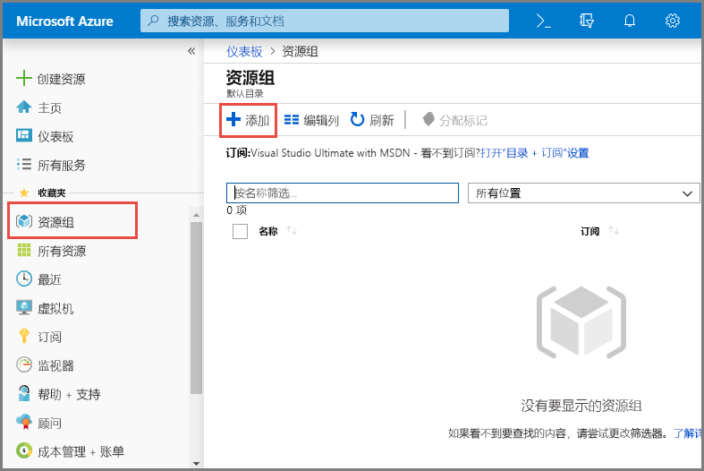

3. 对于“订阅”，请选择要在其中创建资源组的 Azure 订阅的名称。

4. 键入 **资源组的唯一名称**。 系统会立即检查该名称是否在当前选定的 Azure 订阅中可用。

5. 选择资源组所在的 **区域**。

6. 选择“查看 + 创建” 。

   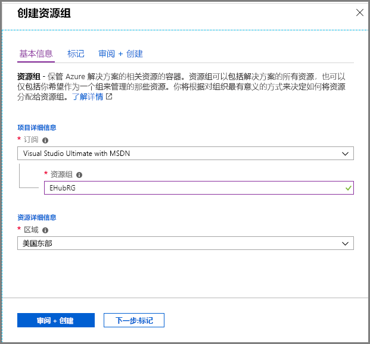

7. 在“查看 + 创建”页上，选择“创建”。

## 创建事件中心命名空间

事件中心命名空间提供唯一的范围容器，可以在该容器中创建一个或多个事件中心。 若要使用门户在资源组中创建命名空间，请执行以下操作：

1. 在 Azure 门户中，选择屏幕左上角的“创建资源”。

2. 在左侧菜单中选择“所有服务”，然后在“分析”类别中的“事件中心”旁边选择 **星号 (`\*`)** 。 确认“事件中心”已添加到左侧导航菜单中的“收藏夹”。

   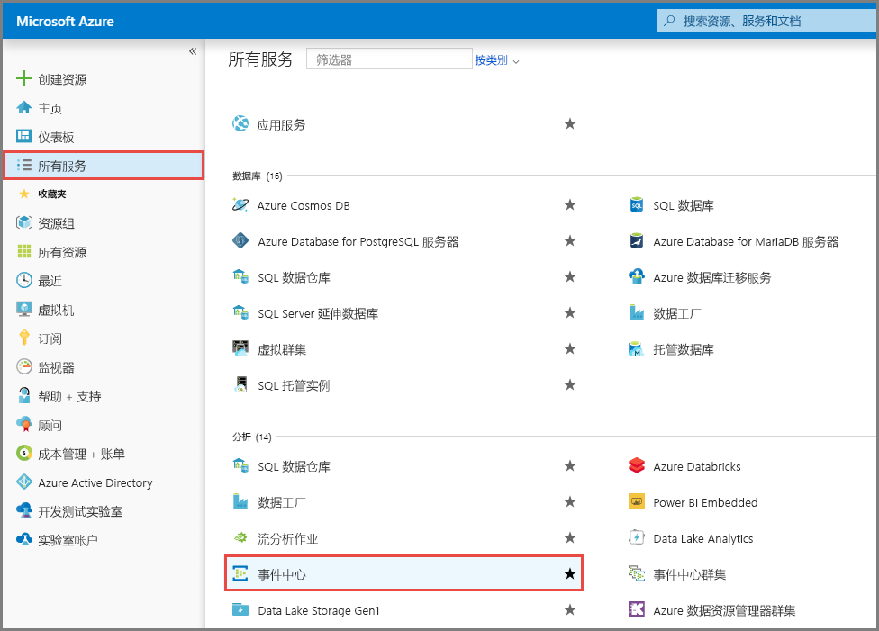

3. 选择左侧导航菜单中“收藏夹”下的“事件中心”，然后选择工具栏上的“添加”。

   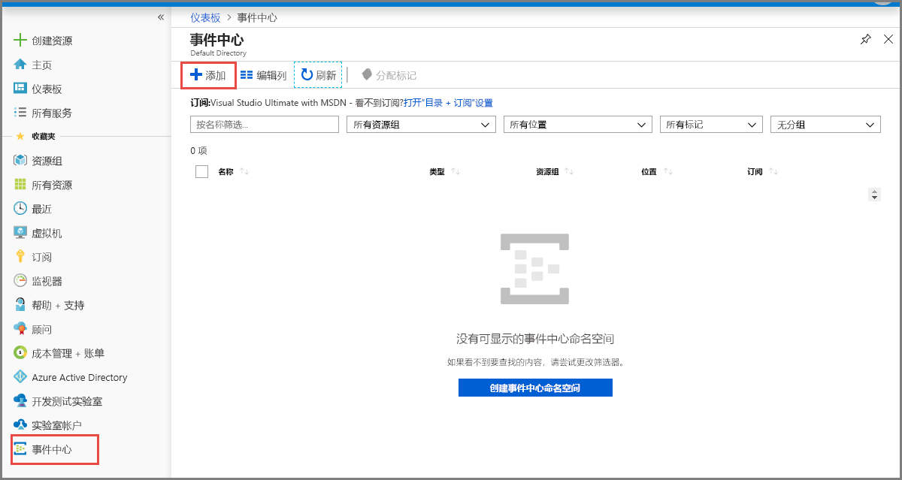

4. 在“创建命名空间”页上执行以下步骤 ：

   1. 选择要在其中创建命名空间的 **订阅**。

   2. 选择在上一步创建的 资源组。

   3. 输入命名空间的 **名称**。 系统会立即检查该名称是否可用。

   4. 选择命名空间所在的 **位置**。

   5. 选择“基本”作为“定价层”。 若要了解各层之间的差异，请参阅以下文章：[配额和限制](https://docs.microsoft.com/zh-cn/azure/event-hubs/event-hubs-quotas)、[事件中心高级版](https://docs.microsoft.com/zh-cn/azure/event-hubs/event-hubs-premium-overview)和[事件中心专用层](https://docs.microsoft.com/zh-cn/azure/event-hubs/event-hubs-dedicated-overview)。

   6. 按原样保留“吞吐量单位”（适用于标准层）或“处理单位”（适用于高级层）设置。 吞吐量单位是预先购买的容量单位。 若要了解吞吐量单位或处理单位，请参阅[事件中心的可伸缩性](https://docs.microsoft.com/zh-cn/azure/event-hubs/event-hubs-scalability)。

   7. 在页面底部选择“查看 + 创建” 。

      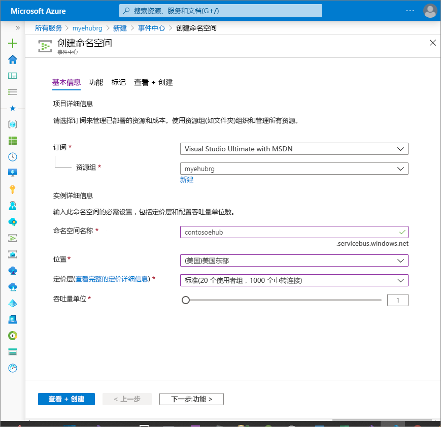

   8. 在“查看 + 创建”页上查看设置，然后选择“创建”。 等待部署完成。

      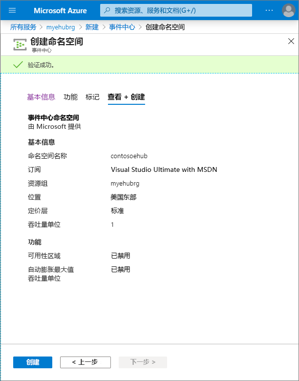

   9. 在“部署” 页上选择“转到资源” ，以便导航到你的命名空间所对应的页面。

      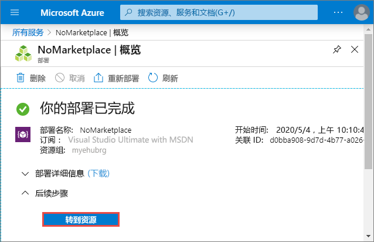

   10. 确认显示的“事件中心命名空间” 页与以下示例类似：

       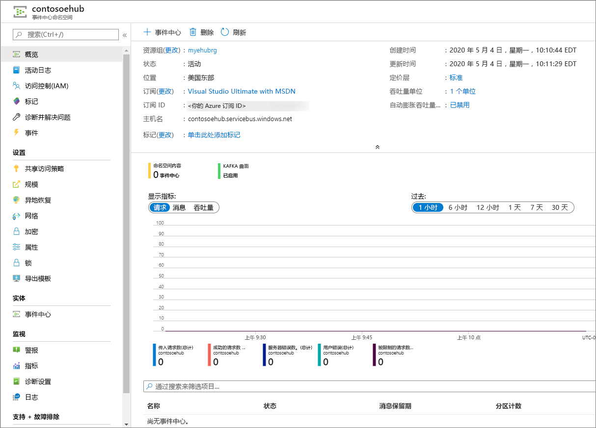

        备注

       Azure 事件中心提供了一个 Kafka 终结点。 此终结点允许事件中心命名空间以本机方式了解 [Apache Kafka](https://kafka.apache.org/intro) 消息协议和 API。 使用此功能，可以像与 Kafka 主题通信那样与事件中心通信，而无需更改协议客户端或运行自己的群集。 事件中心支持 [Apache Kafka 版本 1.0](https://kafka.apache.org/10/documentation.html) 及更高版本。 有关详细信息，请参阅[通过 Apache Kafka 应用程序使用事件中心](https://docs.microsoft.com/zh-cn/azure/event-hubs/event-hubs-for-kafka-ecosystem-overview)。

## 创建事件中心

若要在该命名空间中创建事件中心，请执行以下操作：

1. 在“事件中心命名空间”页上，选择左侧菜单中的“事件中心”。

2. 在窗口顶部，选择“+ 事件中心”。

   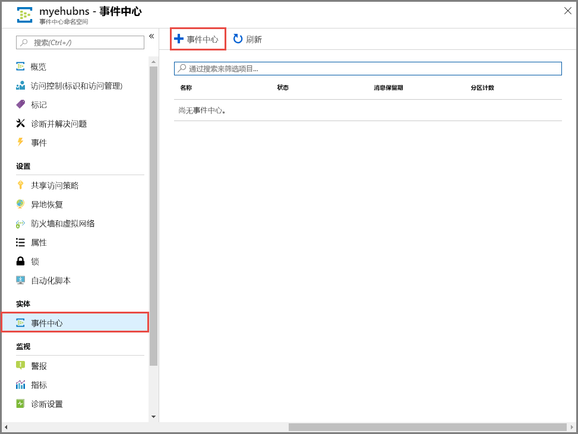

3. 为事件中心键入名称，然后选择“创建”。

   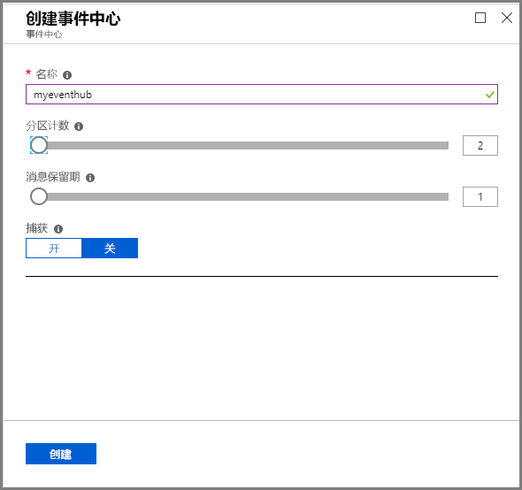

   通过“分区计数”设置可以在多个使用者之间并行使用。 有关详细信息，请参阅[分区](https://docs.microsoft.com/zh-cn/azure/event-hubs/event-hubs-scalability#partitions)。

   “消息保留”设置指定事件中心服务保留数据的时长。 有关详细信息，请参阅[事件保留](https://docs.microsoft.com/zh-cn/azure/event-hubs/event-hubs-features#event-retention)。

4. 可以在警报中检查事件中心的创建状态。 创建事件中心后，事件中心列表中会显示该事件中心。

   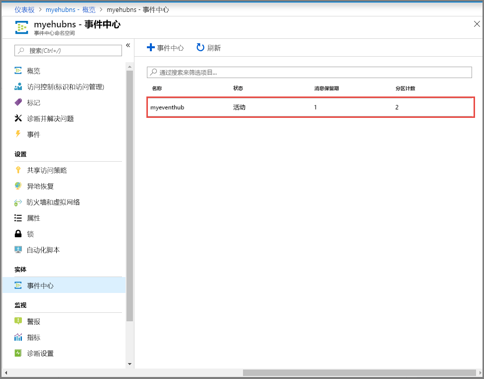

# 创建 Azure Databricks 工作区

在本部分，使用 Azure 门户创建 Azure Databricks 工作区。

1. 在 Azure 门户中，选择“创建资源” > “数据 + 分析” > “Azure Databricks”。

   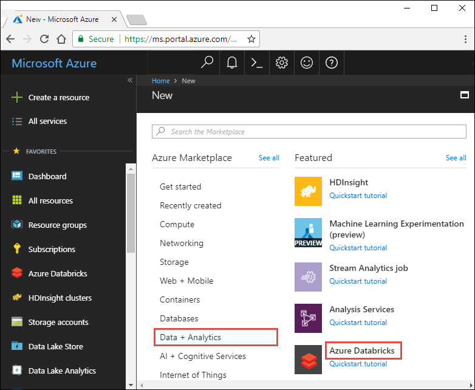

2. 在“Azure Databricks 服务” 下，提供所需的值以创建 Databricks 工作区。

   

   提供以下值：

   | 属性           | 说明                                                         |
   | :------------- | :----------------------------------------------------------- |
   | **工作区名称** | 提供 Databricks 工作区的名称                                 |
   | **订阅**       | 从下拉列表中选择自己的 Azure 订阅。                          |
   | **资源组**     | 指定是要创建新的资源组还是使用现有的资源组。 资源组是用于保存 Azure 解决方案相关资源的容器。 有关详细信息，请参阅 [Azure 资源组概述](https://docs.microsoft.com/zh-cn/azure/azure-resource-manager/management/overview)。 |
   | **位置**       | 选择“美国东部 2”。 有关其他可用区域，请参阅[各区域推出的 Azure 服务](https://azure.microsoft.com/regions/services/)。 |
   | **定价层**     | 选择“标准”或“高级”。 有关这些层的详细信息，请参阅 [Databricks 价格页](https://azure.microsoft.com/pricing/details/databricks/)。 |

   选择“固定到仪表板” ，然后选择“创建” 。

3. 创建帐户需要几分钟时间。 在创建帐户过程中，门户会在右侧显示“正在提交 Azure Databricks 的部署” 磁贴。 可能需要在仪表板上向右滚动才能看到此磁贴。 另外，还会在屏幕顶部附近显示进度条。 你可以查看任一区域来了解进度。

   

## 在 Databricks 中创建 Spark 群集

1. 在 Azure 门户中，转到所创建的 Databricks 工作区，然后选择“启动工作区”。

2. 随后将会重定向到 Azure Databricks 门户。 在门户中选择“群集”。

   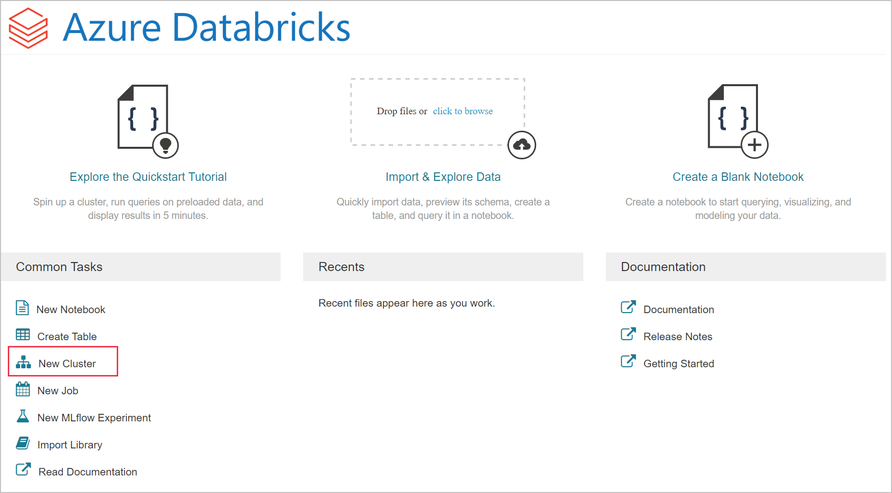

3. 在“新建群集”页中，提供用于创建群集的值。

   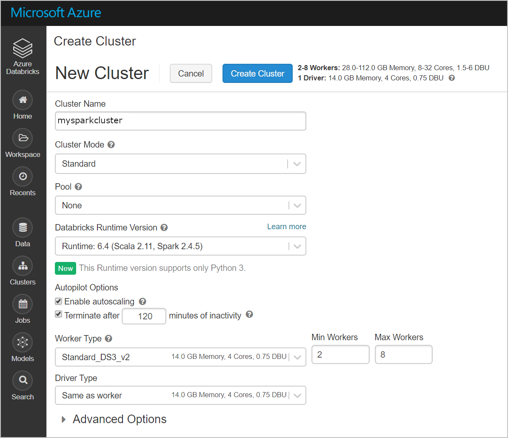

   除以下值外，接受其他所有默认值：

   - 输入群集的名称。
   - 在本文中，请创建运行时为 **6.0** 的群集。
   - 请务必选中 **在不活动超过 __ 分钟后终止** 复选框。 提供一个持续时间（以分钟为单位），如果群集在这段时间内一直未被使用，则会将其终止。

   选择适合你的技术标准和[预算](https://azure.microsoft.com/pricing/details/databricks/)的群集辅助角色和驱动程序节点大小。

   选择“创建群集”。 群集运行后，可将笔记本附加到该群集，并运行 Spark 作业。

# Event Hub生成数据流+落盘

```python
%sh
pip install azure-eventhub
pip install azure-eventhub-checkpointstoreblob-aio
```

```python
import asyncio
from azure.eventhub.aio import EventHubProducerClient
from azure.eventhub import EventData

async def run():
    # Create a producer client to send messages to the event hub.
    # Specify a connection string to your event hubs namespace and
    # the event hub name.
    # producer = EventHubProducerClient.from_connection_string(conn_str="EVENT HUBS NAMESPACE - CONNECTION STRING", eventhub_name="EVENT HUB NAME")
    producer = EventHubProducerClient.from_connection_string(conn_str="Endpoint=sb://eventhub0629.servicebus.windows.net/;SharedAccessKeyName=PreviewDataPolicy;SharedAccessKey=SsuAKxEMhOWzTh6qFQXD1qe8zaRvZfvy4PtEn9n5cps=;EntityPath=myeventhub", eventhub_name="myeventhub")
    async with producer:
        # Create a batch.
        event_data_batch = await producer.create_batch()

        # Add events to the batch.
        event_data_batch.add(EventData('{"ts":1409318650332,"userId":"309","sessionId":1879,"page":"NextSong","auth":"Logged In","method":"PUT","status":200,"level":"free","itemInSession":2,"location":"Killeen-Temple, TX","lastName":"Montgomery","firstName":"Annalyse","registration":1384448062332,"gender":"F","artist":"El Arrebato","song":"Quiero Quererte Querer","length":234.57914}'))
        event_data_batch.add(EventData('{"ts":1409318653332,"userId":"11","sessionId":10,"page":"NextSong","auth":"Logged In","method":"PUT","status":200,"level":"paid","itemInSession":9,"location":"Anchorage, AK","lastName":"Thomas","firstName":"Dylann","registration":1400723739332,"gender":"M","artist":"Creedence Clearwater Revival","song":"Born To Move","length":340.87138}'))
        event_data_batch.add(EventData('{"ts":1409318685332,"userId":"201","sessionId":2047,"page":"NextSong","auth":"Logged In","method":"PUT","status":200,"level":"paid","itemInSession":11,"location":"New York-Newark-Jersey City, NY-NJ-PA","lastName":"Watts","firstName":"Liam","registration":1406279422332,"gender":"M","artist":"Gorillaz","song":"DARE","length":246.17751}'))

        # Send the batch of events to the event hub.
        await producer.send_batch(event_data_batch)

loop = asyncio.get_event_loop()
loop.run_until_complete(run())
```

# Databricks读取数据+ETL

```scala
//读取json文件
val df = spark.read.json("/FileStore/tables/sampledata1.json")
```

```scala
df.show()

val specificColumnsDf = df.select("id","first_name", "last_name", "gender", "ip_address", "email")
specificColumnsDf.show()

val renamedColumnsDF = specificColumnsDf.withColumnRenamed("ip_address", "ip")
renamedColumnsDF.show()
```

