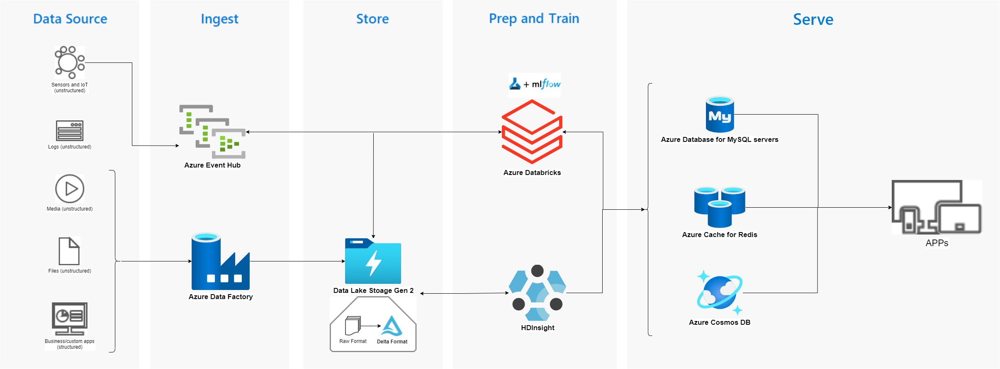

# 杭州吉利汽车Azure大数据平台动手实验 2021/06/29

- [Hands-on Lab 1:](https://github.com/sme-csu/Azure-Data-Hands-on-Labs/blob/main/Hadns-on%20Lab%201/%E5%8A%A8%E6%89%8B%E5%AE%9E%E9%AA%8C%E6%93%8D%E4%BD%9C%E6%89%8B%E5%86%8C.md)
  - 创建基础环境+ADLS gen 2
  - 创建Azure Data Factory
  - 本地数据上传ADLS gen 2
  - 创建cosmos DB
  - 使用ADF迁移数据
- [Hands-on Lab 2:](https://github.com/sme-csu/Azure-Data-Hands-on-Labs/blob/main/Hadns-on%20Lab%202/%E5%8A%A8%E6%89%8B%E5%AE%9E%E9%AA%8C2.md)
  - 创建Azure Event Hub
  - 创建Azure Databricks
  - 使用Event Hub生成流数据+落盘
  - 使用Databricks读数据+ETL

